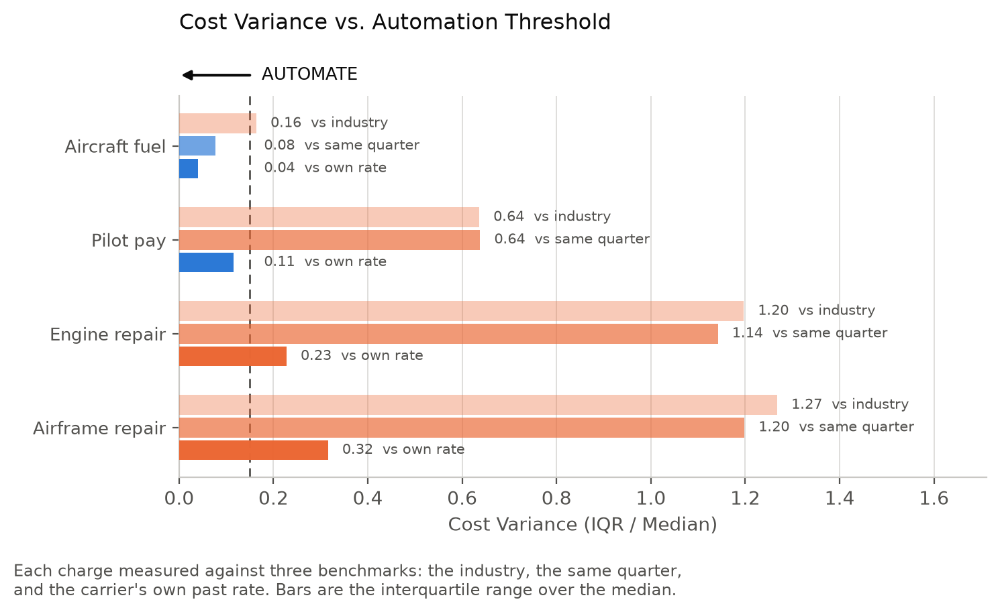

# Airline invoice rate variance

Which vendor charges hold a stable enough unit rate to be driven from master data, and which do not.

Supporting code for *Checking airline invoices in Dynamics 365 F&O*, published by CodeCore Dynamics.

---

## What this does

An invoice line is a rate multiplied by a quantity. If the quantity is already held in your own systems, the rate implied by each invoice can be recovered by dividing one by the other. Whether those rates cluster or scatter determines whether a rate can be written into a contract and enforced by a price tolerance.

This repository runs that test on public US airline financial filings.

| Charge | Unit rate | Variance against the carrier's own rate |
|---|---|---|
| Aircraft fuel | $2.43 / gallon | 0.04 |
| Engine repair | $334 / flight hour | 0.23 |
| Airframe repair | $285 / flight hour | 0.32 |

Variance is the interquartile range divided by the median, so 0.04 means the middle half of observations price within 4 percent of their benchmark. Same carriers, same aircraft, same quarters behind all three.



A second result is that the benchmark matters more than the charge. Fuel measures 0.16 against the industry, 0.08 against the same quarter, and 0.04 against the carrier's own rate. Indexing accounts for half the improvement.

## Data

**BTS Form 41 Schedule P-5.2**, quarterly aircraft operating expenses, 2024 and 2025. 4,805 rows across 47 carriers, 95 aircraft types and 8 quarters.

The CSVs are committed under `Dataset/P-5.2/`, so the repository runs as cloned. They are US government works in the public domain, downloaded from [TranStats, Air Carrier Financial, Schedule P-5.2](https://www.transtats.bts.gov/Tables.asp?QO_VQ=EGI) with all fields selected and Quarter set to All Quarters.

Adding further years needs no code change. Drop another `T_F41SCHEDULE_P52.csv` into a new folder under `Dataset/P-5.2/`; the loader globs recursively.

## Running it

```bash
pip install -r requirements.txt
python run.py
```

Takes about five seconds. Writes `outputs.txt` and four PNGs into the working directory.

### Confirming it worked

Section 3 of `outputs.txt` should report a fuel median of **$2.43 per gallon** and pilot pay of about **$1,498 per flight hour**.

The two are independent, so if either is off the column units have shifted and nothing downstream is reliable. The fuel figure sits roughly 9 percent above the US Gulf Coast jet fuel spot average of $2.227 for the same 24 months, which is the expected direction: BTS account 51451 is delivered cost and carries the supplier differential, into-plane fee and taxes on top of spot.

## Files

| File | Responsibility |
|---|---|
| `run.py` | Entry point. Orchestrates the analysis, the report and the figures. |
| `config.py` | Charge definitions, filters, thresholds, paths. Every tunable value is here. |
| `data.py` | Loading, filtering, and the unit rate and benchmark deviations. |
| `metrics.py` | Least squares fit, size-banded R2, dispersion, benchmark selection. |
| `detection.py` | Synthetic overcharge test. Isolated because no article claim rests on it. |
| `report.py` | Builds `outputs.txt`. One function per section. |
| `style.py` | Palette and matplotlib settings. Imports no analysis code. |
| `figures/rate_spread.py` | Cost variance against each benchmark. |
| `figures/fits.py` | Spend against driver quantity. |
| `figures/deviation.py` | Distribution of invoices around their benchmark. |
| `figures/review_burden.py` | Share of invoices flagged at each tolerance. |

`config.py` holds no logic and `style.py` holds no analysis, so both can be
read first. Nothing imports `run.py`, so any module can be used on its own.

## Parameters that are judgement, not derivation

Three values were chosen rather than computed, and moving them moves some conclusions. They are named here for the same reason they are named in the article.

| Parameter | Where | Value | Effect |
|---|---|---|---|
| `MIN_AMOUNT` | `config.py` | 100 | Drops rows under $100,000 of quarterly spend, where filing rounding dominates the implied rate |
| `MIN_QUARTERS` | `config.py` | 4 | Quarters a carrier and aircraft type needs before it counts as having an established rate |
| `USABLE` | `config.py` | 0.15 | The automation threshold drawn on the rate spread figure. Nothing derives it |

## Code that is present but unused in the article

`detection.py`, and section 5 of `outputs.txt`, run a synthetic overcharge detection test. It adds a known 8 percent overcharge to a random 5 percent of rows and measures what a tolerance recovers.

It is retained because it was part of the work and its result is informative, but **it is not used to support any claim in the article**. It measures detection against a population benchmark, whereas F&O invoice matching compares an invoice to its own purchase order. The two are not the same comparison, so the recovery rates it produces do not answer the question the article asks.

Its output appears in `outputs.txt` and is left there deliberately rather than hidden.

## Known limits

The filings are quarterly aggregates rather than individual invoices. A quarter combines many transactions, so part of the measured variance reflects differences in work mix rather than pricing discipline. **The ordering between charges is the result. The absolute values are not tolerance settings.**

132 fuel rows, 6.1 percent of the file, imply a rate below $1.00 per gallon. These are regional carriers on capacity purchase agreements and ACMI cargo operators, which burn fuel a partner pays for. They are retained, since this reflects a different commercial arrangement rather than a reporting error. Section 4 of `outputs.txt` shows the effect of excluding them: R² moves from 0.922 to 0.986, while the median rate and the variance barely move.

Pilot pay is account 51230, salaries. It is payroll and never meets invoice matching. It is carried through the figures as a reference case only.

No evidence of overcharging at any carrier is presented, and no carrier is identified as such.

## On method

The code in this repository was produced with Claude Code. The dataset and the reported figures were verified against the sources above.

## Licence

MIT. See `LICENSE`.
